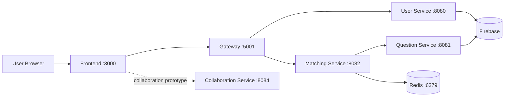

[](https://classroom.github.com/a/HpD0QZBI)

# CS3219 Project (PeerPrep) AY2526S2 - Group 09

PeerPrep is a technical interview preparation platform where users can:

- register and log in,
- join a matchmaking queue by topic and difficulty,
- get matched with another user and a coding question,
- collaborate in a shared coding session.

This repository is organized as a microservices-based system with a Next.js frontend, Express-based backend services, Firebase for user and question data, and Redis for matchmaking queues.

## Tech Stack

- Frontend: Next.js 16, React 19, TypeScript, Tailwind CSS
- Gateway: Express 5, Firebase Admin, http-proxy-middleware
- User Service: Express 5, Firebase Admin, Nodemailer, Multer
- Question Service: Express 5, Firebase Admin
- Matching Service: Express 5, Socket.IO, TypeScript, Redis
- Collaboration Service: Express 5, Socket.IO, Monaco editor prototype
- Infrastructure: Docker, Docker Compose, Redis

## Architecture



## Repository Structure

```text
.
|- frontend/                  # Next.js app
|- gateway/                   # API gateway / reverse proxy
|- services/
|  |- user-service/           # User account and profile APIs
|  |- question-service/       # Question bank APIs
|  |- matching-service/       # Queueing and matchmaking
|  `- collaboration-service/  # Collaboration workspace prototype
|- postman/                   # API request collections
|- docker-compose.yml
`- README.md
```

## Quick Start

### Prerequisites

- Docker Desktop with Docker Compose
- Node.js 20+ for local development
- Firebase service account keys for the services that use Firebase Admin

### Run with Docker Compose

From the repository root:

```bash
docker-compose up
```

Services:

- Frontend: `http://localhost:3000`
- Gateway: `http://localhost:5001`
- User Service: `http://localhost:8080`
- Question Service: `http://localhost:8081`
- Matching Service: `http://localhost:8082`
- Collaboration Service: `http://localhost:8084`
- Redis: `localhost:6379`

Stop everything:

```bash
docker-compose down
```

## Run Services Locally

```bash
# user-service
cd services/user-service
npm install
npm run dev

# question-service
cd ../question-service
npm install
npm run dev

# matching-service
cd ../matching-service
npm install
npm run dev

# collaboration-service
cd ../collaboration-service
npm install
node server.js

# gateway
cd ../../gateway
npm install
npm run dev

# frontend
cd ../frontend
npm install
npm run dev
```

## Configuration

### Docker Compose defaults

- `REDIS_URL=redis://redis:6379`
- `QUESTION_SERVICE_URL=http://question-service:8081`
- `USER_SERVICE_URL=http://user-service:8080`
- `MATCHING_SERVICE_URL=http://matching-service:8082`
- `NEXT_PUBLIC_MATCHING_SERVICE_URL=http://localhost:8082`

### User Service variables used in code

- `FIREBASE_WEB_API_KEY`
- `DEFAULT_PFP_URL`
- `RESEND_API_KEY`
- `EMAIL_USER`
- `TEST_RECIPIENT_EMAIL`

## Main Routes

### Gateway

- `POST /api/users/login`
- `POST /api/users/register`
- `POST /api/users/logout`
- `POST /api/users/forgot-password`
- `POST /api/users/update-password`
- `PATCH /api/users/update-displayName`
- `PATCH /api/users/update-profilePic`
- `POST /api/users/update-progress`
- `GET /api/users/get-stats`
- `GET /api/matching/status`
- `GET /api/matching/categories`
- `GET /api/matching/difficulties`

### Question Service

- `GET /api/questions/metadata/difficulties`
- `GET /api/questions/metadata/topics`
- `GET /api/questions/random`
- `GET /api/questions/:id`
- `POST /api/questions/`
- `PATCH /api/questions/:id`
- `DELETE /api/questions/:id`

### Matching Service Socket Events

Client emits:

- `join_queue`
- `leave_queue`

Server emits:

- `queue_joined`
- `queue_left`
- `match_found`
- `match_timeout`
- `error`

## Current Status

Implemented today:

- auth flows in the frontend,
- user-service account management APIs,
- question-service CRUD and random question retrieval,
- matching-service queueing and match events,
- a collaboration-service browser prototype.

Still partial or prototype-level:

- the landing page currently acts as a matching simulator,
- the lobby and collaboration pages in Next.js are still scaffolds,
- collaboration-service is not fully integrated into the main frontend flow,
- automated testing is still limited.

## Postman Collections

The repository includes request collections under `postman/` for:

- User Service
- Question Service

These are useful for manual API testing during development.

## Notes

- The services rely on Firebase Admin credentials in local service directories.
- The collaboration prototype expects an external Yjs websocket server on `ws://localhost:1234`.
- The gateway currently proxies user-service and matching-service only.

## License

This project is licensed under the MIT License. See [LICENSE](LICENSE) for details.
