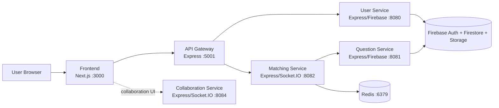

[](https://classroom.github.com/a/HpD0QZBI)

# CS3219 Project (PeerPrep) AY2526S2 - Group 09

PeerPrep is a technical interview preparation platform where users can:

- register/login with role-based access,
- join a matchmaking queue by topic and difficulty,
- get matched with a peer and a random coding question,
- collaborate in a shared coding session.

This repository is organized as a microservices-based system with a Next.js frontend.

## Table of Contents

- [1. System Overview](#1-system-overview)
- [2. Architecture](#2-architecture)
- [3. Tech Stack](#3-tech-stack)
- [4. Repository Structure](#4-repository-structure)
- [5. Running the Project](#5-running-the-project)
- [6. Configuration and Environment Variables](#6-configuration-and-environment-variables)
- [7. API Documentation](#7-api-documentation)
- [8. WebSocket Contracts](#8-websocket-contracts)
- [9. Design Choices and Rationale](#9-design-choices-and-rationale)
- [10. Development Notes](#10-development-notes)
<!-- - [11. Known Gaps / Future Work](#11-known-gaps--future-work) -->

## 1. System Overview

Core services in this repository:

- **Frontend (Next.js, port 3000):** user-facing UI.
- **Gateway (Express, port 5001):** reverse proxy and auth guard for selected User Service routes, proxy to Matching Service REST and WebSocket.
- **User Service (Express + Firebase Admin, port 8080):** account lifecycle, profile management, role logic, stats/progress.
- **Question Service (Express + Firebase Admin, port 8081):** question bank CRUD, metadata, random question retrieval.
- **Matching Service (Express + Socket.IO + Redis, port 8082):** queueing and matching users by topic+difficulty.
- **Collaboration Service (Express + Socket.IO, port 8084):** room and collaboration session scaffolding.
- **Redis (port 6379):** queue storage for matching.

## 2. Architecture



Request and event flow (high-level):

1. User interacts with frontend.
2. Frontend calls gateway for user auth/account APIs.
3. Frontend connects to matching service (or via gateway WebSocket path) for queue events.
4. Matching service pulls queue state from Redis and retrieves random question metadata from question service.
5. Collaboration session is started with room information from matching events.

## 3. Tech Stack

- **Frontend:** Next.js 16, React 19, TypeScript, Tailwind CSS, socket.io-client
- **Gateway:** Node.js, Express 5, http-proxy-middleware, Firebase Admin
- **User Service:** Node.js, Express 5, Firebase Admin (Auth/Firestore/Storage), Nodemailer, Multer, node-cron
- **Question Service:** Node.js, Express 5, Firebase Admin
- **Matching Service:** Node.js, TypeScript, Express 5, Socket.IO, ioredis, Axios
- **Collaboration Service:** Node.js, Express 5, Socket.IO
- **Infra/Orchestration:** Docker, Docker Compose, Redis

## 4. Repository Structure

```text
.
├── frontend/                        # Next.js app
├── gateway/                         # API gateway / reverse proxy
├── services/
│   ├── user-service/                # User account + profile + stats
│   ├── question-service/            # Question repository APIs
│   ├── matching-service/            # Queue + matching + question assignment
│   └── collaboration-service/       # Collaboration rooms + socket events
├── docker-compose.yml
└── README.md
```

## 5. Running the Project

### 5.1 Prerequisites

- Docker and Docker Compose
- Node.js v20+ (for local non-container workflows)

### 5.2 Start everything with Docker Compose

From repository root:

```bash
docker-compose up --build
```

Services:

- Frontend: http://localhost:3000
- Gateway: http://localhost:5001
- User Service: http://localhost:8080
- Question Service: http://localhost:8081
- Matching Service: http://localhost:8082
- Collaboration Service: http://localhost:8084
- Redis: localhost:6379

Stop:

```bash
docker-compose down
```

### 5.3 Run selected services locally (without Compose)

Example (per service):

```bash
# user-service
cd services/user-service
npm install
npm run dev

# question-service
cd ../question-service
npm install
npm run dev

# matching-service
cd ../matching-service
npm install
npm run dev

# collaboration-service
cd ../collaboration-service
npm install
node server.js

# gateway
cd ../../gateway
npm install
npm run dev

# frontend
cd ../frontend
npm install
npm run dev
```

## 6. Configuration and Environment Variables

### 6.1 Docker Compose defaults already wired

In `docker-compose.yml`, these are configured:

- `REDIS_URL=redis://redis:6379` for matching service
- `QUESTION_SERVICE_URL=http://question-service:8081` for matching service
- `USER_SERVICE_URL=http://user-service:8080` for gateway
- `MATCHING_SERVICE_URL=http://matching-service:8082` for gateway
- `NEXT_PUBLIC_MATCHING_SERVICE_URL=http://localhost:8082` for frontend

### 6.2 Service-level variables used in code

**User Service**

- `FIREBASE_WEB_API_KEY`
- `DEFAULT_PFP_URL`
- `RESEND_API_KEY`
- `EMAIL_USER`
- `TEST_RECIPIENT_EMAIL`

**Gateway**

- `USER_SERVICE_URL`
- `MATCHING_SERVICE_URL`

**Matching Service**

- `REDIS_URL`
- `QUESTION_SERVICE_URL`

**Frontend**

- `NEXT_PUBLIC_MATCHING_SERVICE_URL`

### 6.3 Security note

This repository currently contains Firebase service account key files in multiple service directories. For production or public repositories, move these secrets out of source control and load through secure secret management.

## 7. API Documentation

Base URLs:

- **Frontend-facing Gateway Base:** `http://localhost:5001`
- **Direct service bases (internal/dev):** `:8080`, `:8081`, `:8082`, `:8084`

Authentication patterns:

- Protected routes require `Authorization: Bearer <Firebase ID token>`.
- Gateway forwards decoded token payload to user service in header `x-user-data` for protected user routes.

### 7.1 Gateway Routes

#### User routes (proxied to User Service)

Public via gateway:

- `POST /api/users/login`
- `POST /api/users/register`
- `POST /api/users/logout`
- `POST /api/users/forgot-password`

Protected via gateway (requires Bearer token):

- `POST /api/users/update-password`
- `DELETE /api/users/delete-account`
- `PATCH /api/users/update-displayName`
- `POST /api/users/oAuth-Login`
- `PATCH /api/users/update-profilePic` (multipart form)
- `POST /api/users/update-progress`
- `GET /api/users/get-stats`

Admin-protected via gateway (requires Bearer token with `role=Admin`):

- `PATCH /api/users/promote-user`
- `PATCH /api/users/demote-self`

#### Matching routes (proxied to Matching Service)

- `GET /api/matching/status`
- `GET /api/matching/categories`
- `GET /api/matching/difficulties`

#### Matching WebSocket through gateway

- Client connection URL: `ws://localhost:5001`
- Socket.IO path: `/matching-socket`
- Proxied upstream path: `/socket.io` on matching service

### 7.2 User Service API (direct)

Base: `http://localhost:8080/api/users`

| Method | Path                  | Auth                  | Purpose                                                     |
| :----- | :-------------------- | :-------------------- | :---------------------------------------------------------- |
| POST   | `/login`              | No                    | Sign in with email/password (Firebase identity toolkit)     |
| POST   | `/register`           | No                    | Create account, initialize profile, send verification email |
| POST   | `/logout`             | No (expects uid body) | Revoke refresh tokens for a user                            |
| POST   | `/forgot-password`    | No                    | Trigger password reset email                                |
| POST   | `/oAuth-Login`        | Yes                   | Create/sync profile for OAuth-authenticated user            |
| POST   | `/update-password`    | Yes                   | Validate old password and set new password                  |
| PATCH  | `/update-profilePic`  | Yes                   | Upload profile image to Firebase Storage                    |
| PATCH  | `/update-displayName` | Yes                   | Update display name in Firestore and custom claims          |
| DELETE | `/delete-account`     | Yes                   | Delete user account (last-admin protection applied)         |
| PATCH  | `/promote-user`       | Admin                 | Promote another user to admin                               |
| PATCH  | `/demote-self`        | Admin                 | Demote own admin role (cannot demote last admin)            |
| POST   | `/update-progress`    | Yes                   | Record first-time question attempt + aggregate stats        |
| GET    | `/get-stats`          | Yes                   | Retrieve aggregated attempt stats                           |

Example request (login):

```http
POST /api/users/login
Content-Type: application/json

{
   "email": "user@example.com",
   "password": "Password123"
}
```

Example success payload (login):

```json
{
  "message": "Login successful",
  "accessToken": "<idToken>",
  "refreshToken": "<refreshToken>",
  "uid": "<firebase_uid>"
}
```

### 7.3 Question Service API (direct)

Base: `http://localhost:8081/api/questions`

| Method | Path                     | Auth          | Purpose                                                       |
| :----- | :----------------------- | :------------ | :------------------------------------------------------------ |
| GET    | `/metadata/difficulties` | No            | Return supported difficulties                                 |
| GET    | `/metadata/topics`       | No            | Return supported topics                                       |
| GET    | `/`                      | Authenticated | List questions (optional `difficulty`, `topic` query filters) |
| GET    | `/random`                | No            | Random question by `difficulty` and `topic` (or `category`)   |
| GET    | `/editinfo/:id`          | Admin         | Fetch single question for edit context                        |
| GET    | `/:id`                   | Authenticated | Fetch question by ID                                          |
| POST   | `/`                      | Admin         | Create a question                                             |
| PATCH  | `/:id`                   | Admin         | Partially update a question                                   |
| DELETE | `/:id`                   | Admin         | Delete a question                                             |
| POST   | `/seed`                  | Admin         | Seed sample questions                                         |

Example request (random question):

```http
GET /api/questions/random?difficulty=medium&topic=algorithms
```

### 7.4 Matching Service REST API (direct)

Base: `http://localhost:8082`

| Method | Path            | Auth | Purpose                                             |
| :----- | :-------------- | :--- | :-------------------------------------------------- |
| GET    | `/status`       | No   | Queue sizes by key (e.g., `algorithms:easy`)        |
| GET    | `/categories`   | No   | Available categories loaded from question service   |
| GET    | `/difficulties` | No   | Available difficulties loaded from question service |

### 7.5 Collaboration Service HTTP API (direct)

Base: `http://localhost:8084`

| Method | Path              | Auth | Purpose                             |
| :----- | :---------------- | :--- | :---------------------------------- |
| GET    | `/`               | No   | Basic landing response              |
| GET    | `/collab/:roomid` | No   | Serve collaboration page for a room |

## 8. WebSocket Contracts

### 8.1 Matching Service Socket.IO

Direct connection:

- URL: `ws://localhost:8082`
- Default Socket.IO path: `/socket.io`

Gateway connection:

- URL: `ws://localhost:5001`
- Path: `/matching-socket`

Client events emitted:

- `join_queue` payload

```json
{
  "userId": "user-a",
  "category": "Algorithms",
  "difficulty": "Medium"
}
```

- `leave_queue` payload

```json
{
  "userId": "user-a"
}
```

Server events emitted:

- `queue_joined` payload: `{ "message": "..." }`
- `queue_left` payload: `{ "message": "..." }`
- `match_found` payload:

```json
{
  "roomId": "room-<timestamp>-<userA>-<userB>",
  "partner": "other-user-id",
  "question": {
    "id": "...",
    "title": "...",
    "description": "..."
  }
}
```

- `match_timeout` payload: `{ "message": "Matchmaking timed out." }`
- `error` payload: `{ "message": "..." }`

### 8.2 Collaboration Service Socket.IO

Connection:

- URL: `ws://localhost:8084`

Client events emitted:

- `join-room` payload shape in current implementation: `(roomId, questionId)` positional args

Server events emitted:

- `init-room-data` payload: `{ questionId }`
- `timer-update` payload: `{ remaining, isWarning }`
- `user-joined` payload: message string
- `user-left` payload: message string
- `user-count-update` payload: integer count
- `room-destroyed` payload: no body

## 9. Design Choices and Rationale

### 9.1 Microservices split by domain responsibility

- **Why:** User management, question management, matching, and collaboration have different scaling profiles and data concerns.
- **Benefit:** Services can evolve independently; matching logic can be optimized without changing account or content domains.

### 9.2 Gateway as entry point for user-facing REST

- **Why:** Centralize route exposure and token verification for user APIs.
- **Benefit:** Frontend uses one stable host/port for auth-related flows and can avoid duplicating verification concerns.

### 9.3 Redis-backed queueing for matchmaking

- **Why:** Queue operations (`lpop`, `rpush`, `lrem`) are simple and fast, ideal for transient matchmaking state.
- **Benefit:** Efficient queue management and straightforward timeout cleanup.

### 9.4 Matching metadata sourced from Question Service

- **Why:** Topic/difficulty taxonomy should come from question domain instead of being duplicated.
- **Benefit:** One source of truth for valid categories/difficulties.

### 9.5 Role-based controls with Firebase custom claims

- **Why:** Admin-only operations must be enforced consistently.
- **Benefit:** Claims-based checks support lightweight authorization logic across services.

### 9.6 Time-bounded sessions and cleanup paths

- **Why:** Collaboration rooms and matchmaking queues are ephemeral.
- **Benefit:** Avoid stale rooms/queue entries and reduce memory/resource leak risk.

## 10. Development Notes

### 10.1 Useful service commands

**Frontend**

- `npm run dev`
- `npm run build`
- `npm run lint`

**Gateway**

- `npm run dev`

**User Service**

- `npm run dev`
- `npm start`

**Question Service**

- `npm run dev`
- `npm start`

**Matching Service**

- `npm run dev`
- `npm run build`
- `npm start`
- `npm run lint`

### 10.2 CORS and network notes

- Gateway CORS currently allows `http://localhost:3000`.
- Matching service CORS currently allows all origins (`*`).

<!-- ## 11. Known Gaps / Future Work

- Collaboration UI in Next.js is currently a structural placeholder and can be integrated more deeply with real-time collaboration APIs.
- Matching uses a strict same-topic and same-difficulty strategy; progressive relaxation and wait-time estimation are opportunities.
- End-to-end automated tests and contract tests can be expanded across service boundaries.
- Secrets management should be hardened for production (remove static keys from repository). -->
